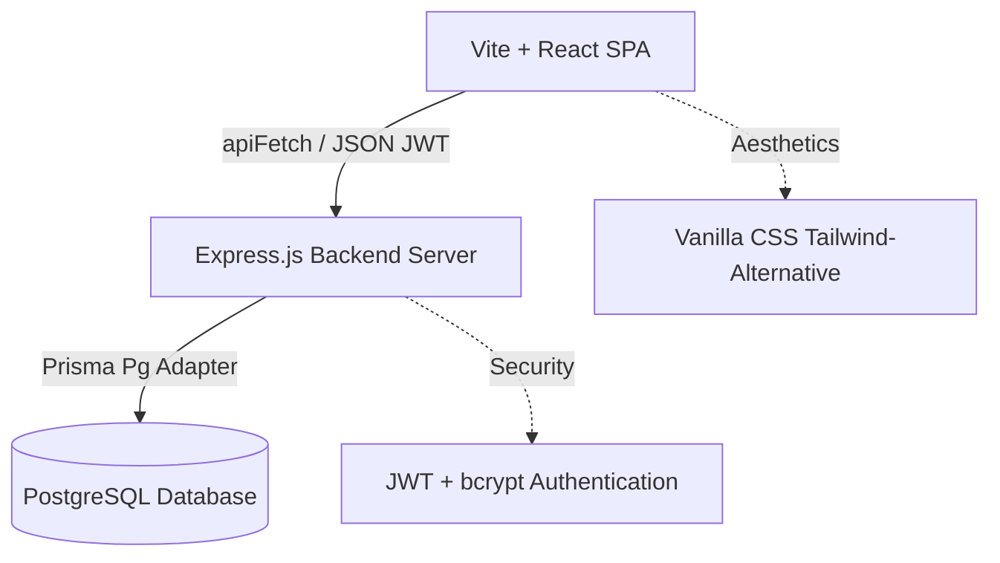

# AssetFlow — Enterprise Asset Management System

AssetFlow is a modern, state-of-the-art enterprise asset management platform designed to track physical and digital hardware assets, manage user/department allocations, handle resources scheduling, and streamline maintenance and audit cycles. 

Built with **Vite/React** on the frontend, **Express/Node.js** on the backend, and **Prisma ORM with PostgreSQL** for database persistence, AssetFlow is optimized for scale, security, and exceptional user experience.

---

## 🚀 Key Features

*   **Role-Based Access Control (RBAC)**: Secure access mapped out for four distinct enterprise roles:
    *   `ADMIN`: Complete access to all pages, metrics, organization setups, role promotions, asset registrations, and audits.
    *   `ASSET_MANAGER`: Standard management controls covering the asset directory, booking, maintenance boards, and audit cycles.
    *   `DEPARTMENT_HEAD`: Department-specific overview of checked-out inventory, reports, bookings, and request approvals.
    *   `EMPLOYEE`: View assigned hardware, schedule resources (bookings), raise maintenance requests, and track notifications.
*   **Asset Master Registry**: Live master catalog of all hardware assets featuring tag assignments, categories, location tracking, and real-time status badges.
*   **Smart Booking Scheduler**: Shared-resource booking system with built-in overlap prevention validation.
*   **Maintenance Request Kanban**: End-to-end maintenance workflow transition engine (`Pending` ➔ `Approved`/`Rejected` ➔ `Technician Assigned` ➔ `In Progress` ➔ `Resolved`).
*   **Audit Cycles**: Department-wide planning and checking cycles to track and flag missing or damaged hardware assets.
*   **Notifications Hub**: Live user-specific alerts that can be dismissed or marked read directly via database updates.

---

## 🛠️ Architecture & Tech Stack



### Frontend
- **Framework**: React 18 (Vite SPA template)
- **Styling**: Vanilla CSS with a modern, HSL-variable-driven custom design system (supporting dark/light theme tokens, card dropshadows, and custom status badges).
- **Icons & Micro-animations**: Smooth hover transitions and dynamic UI elements.
- **Routing**: `react-router-dom` with a custom `ProtectedRoute` route guard.

### Backend
- **Framework**: Node.js & Express.js
- **ORM**: Prisma Client utilizing `@prisma/adapter-pg`
- **Database**: PostgreSQL
- **Security**: JWT-based stateless authentication, password hashing via `bcrypt`, and endpoint role-verification middleware.

---

## 📂 Project Structure

```text
AssetFlow/
├── backend/
│   ├── controllers/      # Route request/response handlers
│   ├── middleware/       # JWT auth & RBAC validation middleware
│   ├── prisma/           # Database schema definition & seeding scripts
│   │   ├── schema.prisma # PostgreSQL prisma schema
│   │   └── seed.js       # Enterprise mock-data seed script
│   ├── routes/           # REST API endpoints mapping
│   ├── services/         # Database query logic
│   └── server.js         # Express main application entrypoint
├── frontend/
│   ├── src/
│   │   ├── components/   # Shared UI components (Table, Navbar, StatusBadge, AssetChip)
│   │   ├── context/      # React Auth state provider
│   │   ├── pages/        # Dashboard, Directories, Bookings, Maintenance, Audits
│   │   ├── services/     # API fetch wrapper calls
│   │   ├── App.jsx       # Component routing & Guard registry
│   │   ├── index.css     # Design tokens and global variables
│   │   └── main.jsx      # React DOM bootstrap
└── package.json          # Root configuration
```

---

## ⚙️ Getting Started

### Prerequisites
- Node.js (v18 or higher recommended)
- PostgreSQL database instance

### Backend Setup

1. Navigate to the backend directory:
   ```bash
   cd backend
   ```
2. Install dependencies:
   ```bash
   npm install
   ```
3. Create a `.env` file in the `backend/` root directory and set up your environment variables:
   ```env
   PORT=5000
   DATABASE_URL="postgresql://<username>:<password>@<host>:<port>/<dbname>?schema=public"
   JWT_SECRET="your_jwt_signing_key_here"
   ```
4. Generate Prisma Client and apply migrations:
   ```bash
   npx prisma migrate dev
   ```
5. Seed the database with the enterprise role profiles and initial inventory:
   ```bash
   node prisma/seed.js
   ```

### Frontend Setup

1. Navigate to the frontend directory:
   ```bash
   cd ../frontend
   ```
2. Install dependencies:
   ```bash
   npm install
   ```
3. Run the Vite development server:
   ```bash
   npm run dev
   ```
4. Access the web app locally at `http://localhost:5173`.

---

## 📊 Database Seed Credentials

When you run `node prisma/seed.js`, the system creates the following test accounts (all passwords are set to their respective role passwords):

| Role | Email | Password | Allowed Navigation Pages |
| :--- | :--- | :--- | :--- |
| **Admin** | `admin@assetflow.com` | `Admin@123` | Dashboard, Organization Setup, Employee Directory, Asset Directory, Booking, Maintenance, Audit, Reports, Notifications |
| **Asset Manager** | `manager@assetflow.com` | `Manager@123` | Dashboard, Asset Directory, Booking, Maintenance, Audit, Reports, Notifications |
| **Department Head** | `head@assetflow.com` | `Head@123` | Dashboard, Department Assets, Booking, Reports, Notifications |
| **Regular Employee** | `employee@assetflow.com` | `Employee@123` | Dashboard, My Assets, Booking, Maintenance, Notifications |

---

## 📡 API Endpoint Reference

All endpoints requiring headers need: `Authorization: Bearer <jwt_token>`

### Authentication
- `POST /api/auth/signup`: Create a new user profile (defaults to `employee` role).
- `POST /api/auth/login`: Authenticate email + password and return JWT + User metadata.

### Asset Management
- `GET /assets`: Retrieve all assets in database (includes category details).
- `POST /assets`: Register a new hardware asset (Admin/Asset Manager only).
- `PUT /assets/:id`: Update asset location, status, tag, or description.
- `DELETE /assets/:id`: Remove asset from system registry.

### Allocations (Checkout)
- `GET /allocations/my`: Returns active allocations checked out to current logged-in employee.
- `GET /allocations/department`: Returns active allocations assigned to department cost centers.
- `POST /allocations`: Create new allocation (assign asset to user or department).
- `PATCH /allocations/:id/return`: Mark checkout allocation as returned.

### Resource Booking
- `GET /bookings`: Fetch booking records (with optional query filters).
- `GET /bookings/assets`: Lists available hardware items suitable for room/projector booking.
- `POST /bookings`: Book asset. Prevents overlapping slots.
- `PATCH /bookings/:id/cancel`: Cancel an active booking slot.

### Maintenance Requests
- `GET /maintenance`: Fetch all maintenance logs.
- `POST /maintenance`: Raise a new hardware repair ticket.
- `PATCH /maintenance/:id/approve`: Approve repair request.
- `PATCH /maintenance/:id/reject`: Deny repair request.
- `PATCH /maintenance/:id/assign`: Assign technician name to request.
- `PATCH /maintenance/:id/resolve`: Close request with resolution notes.

### Notifications
- `GET /notifications`: Get system notifications for logged-in user.
- `PATCH /notifications/:id/read`: Mark notification as read.
